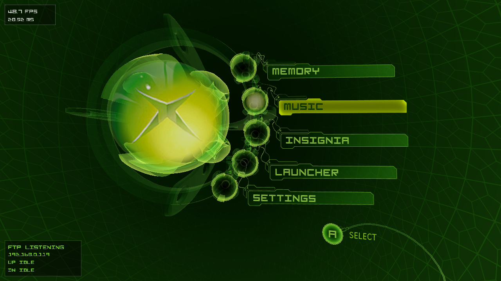
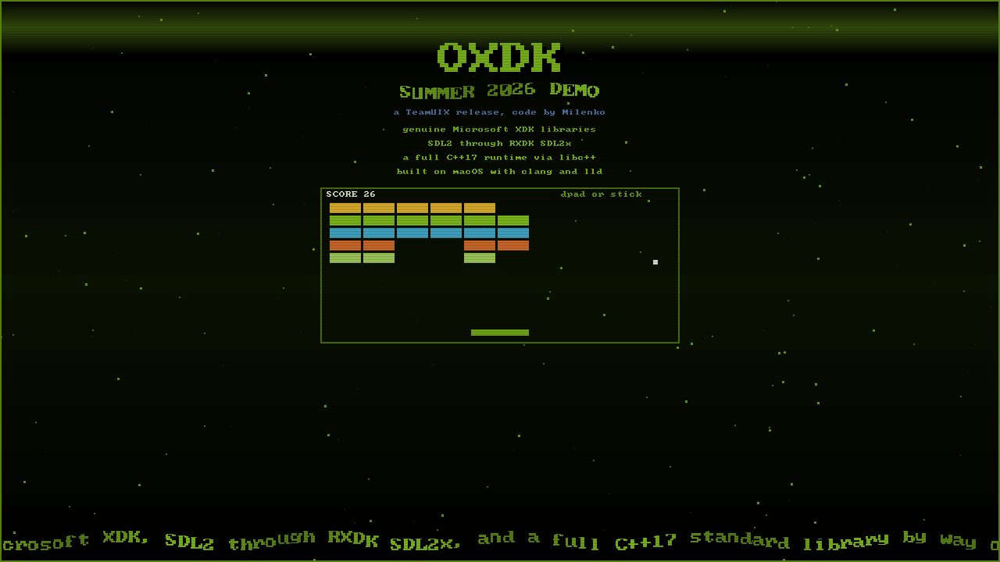
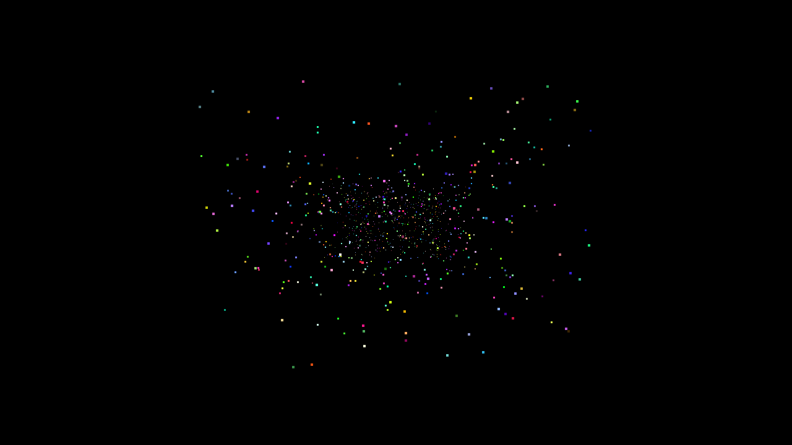
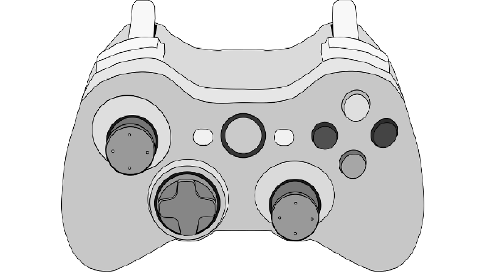

# OXDK, Old Xbox Development Kit

A cross-compilation shim that lets you build original Xbox XDK projects on macOS (and Linux) using clang and lld-link, without needing a Windows VM or MSVC.

Built for [Theseus](https://github.com/MrMilenko/Theseus) development because using a Windows VM to compile 2003-era C++ is a crime against humanity. Also because the author tore his meniscus and fractured two ribs, and waddling between computers to load Windows VMs while on a drug-fueled surgery bender seemed like a problem worth solving permanently.

When we say "we" in this document, it's the royal We. It sounds better than "I did this alone in my living room on painkillers." Tested on real hardware by members of [TeamUIX](https://github.com/OfficialTeamUIX).

## Showcase

OXDK compiles the Xbox side of [Theseus](https://github.com/MrMilenko/Theseus), the reverse-engineered original Xbox Dashboard engine. The same engine powers UIX Desktop on macOS, Linux, and Windows from the shared repo. Here it is on real hardware:



The samples in this repo are all built with OXDK and booted on a console too. Left to right: the OXDK Summer 2026 Demo (SDL 2 video and input with a block breaker mini game in libc++), then RXDK-SDL2x plasma, starfield, and testgamecontroller.

 
 

Shots are framebuffer captures over XBDM from a debug Xbox.

## What This Is

OXDK bridges the gap between modern clang and the Microsoft Xbox SDK (circa 2003). It handles the ABI differences, calling conventions, header conflicts, and PE-to-XBE conversion needed to produce bootable Xbox executables from a Unix-based host.

This is **not** a replacement for the XDK. You need your own copy of the Microsoft Xbox SDK headers and libraries. OXDK just provides the tooling to use them with clang instead of MSVC.

## What This Isn't

This is not [NXDK](https://github.com/XboxDev/nxdk). NXDK is an open-source Xbox development kit with its own runtime, D3D implementation, and HAL. OXDK takes the opposite approach, it uses the original Microsoft XDK libraries directly. This means full compatibility with existing XDK projects, but requires you to supply the proprietary SDK files yourself.

## Prerequisites

- **clang** (Apple clang or LLVM, any recent version)
- **lld-link** (LLVM's MSVC-compatible linker)
  - macOS: `brew install llvm`, then ensure `lld-link` is on your PATH
  - Linux: install the `lld` package from your distro
- **Microsoft Xbox SDK** headers and libraries (you supply these)
- **make** (GNU make)
- **Python 3** and **Pillow**: optional, only needed for `tools/xbx/xbx_convert.py` (`pip install Pillow`)

## Getting Started

### 1. Clone

```sh
git clone https://github.com/YourUser/OXDK.git
cd OXDK
```

### 2. Build cxbe

```sh
make -C tools/cxbe
```

### 3. Install your XDK files

Copy files from your Xbox SDK install into the `xdk/` directory:

```sh
# From your XDK install (typically C:\Program Files\Microsoft Xbox SDK\xbox\)
cp /path/to/xdk/lib/*.lib   xdk/lib/
cp -r /path/to/xdk/include/ xdk/include/
```

You need at minimum: `xboxkrnl.lib`, `d3d8.lib` (or `d3d8d.lib`), `xapilib.lib`, `libcmt.lib` (or `libcmtd.lib`), and the corresponding headers.

### 4. Normalize filename case (Linux / case-sensitive filesystems)

The XDK ships with mixed-case filenames (`XTL.H`, `D3d8.h`, ...) but source code refers to them in lowercase (`#include <xtl.h>`). macOS's default filesystem doesn't care; Linux does. Run this once after copying files in:

```sh
./tools/normalize-xdk.sh xdk/
```

Or from inside a project that includes `oxdk.mk`:

```sh
make normalize-xdk
```

It's a no-op on case-insensitive filesystems, so it's safe to run on macOS too.

### 5. Verify

```sh
cd samples/d3d/hello
make
```

If it builds to `bin/default.xbe`, you're good. Copy that to your Xbox and you should see a sea creature bouncing around the screen.

## Usage

### Option A: Wrapper Scripts

OXDK provides compiler and linker wrappers in `bin/` that handle all the flags for you:

```sh
# Compile
./bin/oxdk-cxx -c -o main.obj main.cpp

# Link
./bin/oxdk-link /out:myapp.exe main.obj xboxkrnl.lib d3d8.lib xapilib.lib libcmt.lib

# Convert PE to XBE
./tools/cxbe/cxbe -MODE:RETAIL -TITLE:"My App" -OUT:default.xbe myapp.exe
```

### Option B: Makefile Integration

For real projects, copy `Makefile.template` into your project directory, rename it to `Makefile`, and edit:

```makefile
OXDK_DIR  = $(HOME)/OXDK
XBE_TITLE = My App
XBE_MODE  = RETAIL

SRCS = main.cpp render.cpp audio.cpp

include $(OXDK_DIR)/oxdk.mk
```

Then:

```sh
make        # build
make clean  # clean
```

The output lands in `bin/default.xbe`.

### Option C: Just the Flags

If you want full control over your build system, the critical flags are:

```sh
# Compile
clang++ -target i386-pc-windows-msvc -march=pentium3 \
    -fms-extensions -fms-compatibility -fms-compatibility-version=13.10 \
    -fno-rtti -fno-exceptions \
    -Xclang -fdefault-calling-conv=stdcall \
    -D_XBOX -D_X86_ \
    -include /path/to/OXDK/xdk_compat.h \
    -c -o main.obj main.cpp

# Link
lld-link /subsystem:windows /fixed:no /base:0x00010000 /stack:1048576 \
    /machine:x86 /entry:mainCRTStartup /nodefaultlib /force:multiple \
    /safeseh:no /out:myapp.exe main.obj [libs...]

# PE to XBE
cxbe -MODE:RETAIL -TITLE:"My App" -OUT:default.xbe myapp.exe
```

The flag you absolutely cannot skip is **`-Xclang -fdefault-calling-conv=stdcall`**. Without it, every function call between your code and the XDK libs corrupts the stack.

## SDL and Modern C++

OXDK builds real libraries against the XDK, not just bare D3D. Each one has samples under `samples/`:

- **SDL 1.2** via [libSDLx](https://github.com/HyperEye/SDLx). See `samples/libsdlx/sdl_test`.
- **SDL 2** via [RXDK-SDL2x](https://github.com/Team-Resurgent/RXDK-SDL2x). The `third-party/SDL2x/oxdk/sdl2x.mk` glue builds any libSDL2x consumer in about fifteen lines; `samples/sdl2x/` has ten of them. Our local fixes to the port live in that vendored tree, pending upstream PRs.
- **Modern C++17** via libc++. The XDK's own STL is C++98, so anything that touches `std::vector`, `std::unordered_map`, `<random>`, `<type_traits>` and friends needs a modern standard library. Set `OXDK_LIBCXX=1` and OXDK routes the C++ stdlib to LLVM's libc++ (the support files live in `oxdk/`). This needs libc++ headers on the host; `brew install llvm` provides them on macOS, otherwise point `OXDK_LIBCXX_DIR` at your libc++ `include/c++/v1`.

`samples/sdl2x/scene` ties it together: SDL 2 video and input, a libc++ block breaker, all linked against the genuine XDK.

## Debugging

For live `OutputDebugString` / `DbgPrint` output and XBDM probes on macOS and Linux, use [xbMacson](https://github.com/MrMilenko/xbMacson), a cross-platform terminal Xbox Debug Monitor that clones xbWatson's notification model. It pairs naturally with OXDK builds and captured the framebuffer screenshots above.

## Kernel Import Decorations

Clang generates undecorated import symbols, but `xboxkrnl.lib` uses stdcall-decorated names (`__imp__FunctionName@N`). OXDK includes mappings for common kernel functions in `oxdk.mk`. If you call a kernel function that isn't mapped, you'll get an undefined symbol error at link time. Fix it by adding:

```
/alternatename:__imp__YourFunction=__imp__YourFunction@N
```

Where `N` is the total size of the function's parameters in bytes (e.g., 2 DWORDs = 8).

## What OXDK Fixes Under the Hood

Getting clang to produce valid Xbox executables required solving a few non-obvious problems:

**Calling Convention (`-Xclang -fdefault-calling-conv=stdcall`)**
Xbox XDK projects compile with MSVC's `/Gz` flag, making `__stdcall` the default calling convention for all functions. Clang defaults to `__cdecl`. Without this flag, every cross-module function call silently corrupts the stack. It might survive a few calls before crashing, which makes it especially fun to debug.

**XDK Header Compatibility (`xdk_compat.h`)**
The XDK headers assume MSVC-specific include ordering for NT kernel types. The compat shim pulls in the right type definitions before the XDK headers try to define their own, preventing redefinition conflicts.

**cxbe Tweaks (section flags, library versions)**
cxbe from NXDK handles PE-to-XBE conversion. During testing we made two tweaks for XDK-linked binaries, and things started working. Whether these are strictly necessary or if the calling convention fix above was the real solution, we're honestly not sure, they were made during the debugging process and we never went back to test without them:
- All XBE sections are marked executable
- Library version entries are read from the PE's `.XBLD` section instead of using a placeholder

## Asset Tools

### `tools/xbx/`: XPR0 texture converter

Bidirectional converter between Xbox XPR0 (`.xbx`) textures and standard image formats. Useful for extracting assets from an existing title, producing new ones from PNGs, or modifying skin artwork for dashboards like [UIX-Lite](https://github.com/OfficialTeamUIX/UIX-Lite) and [Theseus](https://github.com/MrMilenko/Theseus).

Two implementations:

- **`tools/xbx/go/`**: pure Go, zero dependencies. Pre-built binaries for Linux/macOS/Windows (amd64 + arm64) are attached to each [release](https://github.com/MrMilenko/OXDK/releases). Recommended for skinners.
- **`tools/xbx/xbx_convert.py`**: Python + Pillow. Functionally equivalent.

See [`tools/xbx/README.md`](tools/xbx/README.md) for the full skinner workflow and developer notes.

## Limitations

- **Modded consoles only.** XBE section digests and the digital signature are zeroed out. Stock retail consoles will reject them. Softmod, TSOP, and modchip all work fine.
- **D3D debug asserts.** If you link debug D3D libs (`d3d8d.lib`) and have a debugger attached, you'll hit assert breakpoints. Use release libs (`d3d8.lib`) for clean runs, or just don't attach a debugger.
- **For-loop scoping.** MSVC 7.1 leaks variables declared in for-init into the enclosing scope (`/Zc:forScope-`). Clang follows the C++ standard. If you're porting older XDK code, you may need to hoist variable declarations above for-loops.
- **No guarantees.** This was built to compile one specific project. It works for that. It might work for yours. It might not. Good luck.

## Project Structure

```
OXDK/
  bin/
    oxdk-cc            C compiler wrapper
    oxdk-cxx           C++ compiler wrapper
    oxdk-link          linker wrapper
  oxdk/                modern C++ (libc++) support, enabled with OXDK_LIBCXX=1
    libcxx-config/     __config_site tuned for the i386-xbox target
    libcxx-cshim/      clean C headers that coexist with libc++
    libcxx-shim/       runtime pieces libc++ normally pulls from libc++.a
  samples/
    d3d/hello/             minimal D3D test app (definitely not a dolphin)
    libsdlx/sdl_test/      SDL 1.2 sample (libSDLx)
    sdl2x/                 SDL 2 samples (RXDK-SDL2x), including the scene demo
    libcxx/cxx17_hello/    modern C++17 on libc++, no SDL
  third-party/
    libSDLx/           vendored SDL 1.2 Xbox port
    SDL2x/             vendored RXDK-SDL2x (SDL 2) with our patches + oxdk/ glue
  tools/
    cxbe/              PE-to-XBE converter from NXDK, tweaked for XDK binaries
    xbx/               Xbox XPR0 (.xbx) texture <-> PNG converter
    normalize-xdk.sh   lowercase XDK filenames for case-sensitive filesystems
  xdk/
    lib/               drop your XDK .lib files here
    include/           drop your XDK headers here
  oxdk.mk             includeable Makefile for project integration
  xdk_compat.h        force-included compatibility shim
  Makefile.template    copy this into your project to get started
```

## Acknowledgments

Thanks to the [NXDK](https://github.com/XboxDev/nxdk) team. cxbe comes from their project, and their work proving that clang and lld-link could target the Xbox is what made this possible. OXDK takes a different approach, using the original XDK libraries instead of replacing them, but the foundation they built on the toolchain side saved us a lot of time.

The libraries OXDK builds against are other people's work; we only wrote the toolchain glue:

- **SDL**, from [libsdl.org](https://www.libsdl.org/).
- **libSDLx**, the SDL 1.2 Xbox port originally by Lantus, vendored from [HyperEye/SDLx](https://github.com/HyperEye/SDLx). It bundles its own zlib, freetype, vorbis, and friends.
- **RXDK-SDL2x** and **RXDK**, the SDL 2 port and modern Xbox dev environment from [Team Resurgent](https://github.com/Team-Resurgent).
- **libc++**, from the [LLVM project](https://github.com/llvm/llvm-project).

## License

The OXDK shim code (scripts, oxdk.mk, xdk_compat.h) is public domain. Do whatever you want with it.

cxbe is from [NXDK](https://github.com/XboxDev/nxdk) and carries its original license (see `tools/cxbe/` for details).

The vendored libraries under `third-party/` (libSDLx, RXDK-SDL2x) carry their own upstream licenses; see each tree. Our patches to them are offered back under the same terms.

The Microsoft Xbox SDK is proprietary. OXDK does not include any Microsoft code. You are responsible for obtaining and licensing the SDK files yourself.
